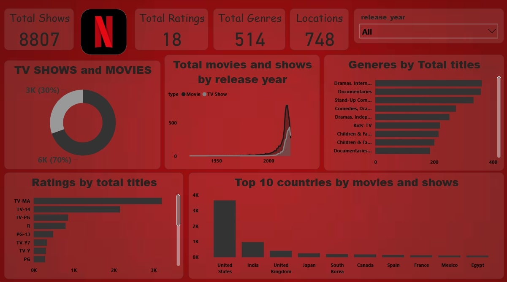

# 🎬 Netflix Content Analytics Dashboard: Unlocking Streaming Success 🚀

## 🌟 Project Overview
Transform Netflix's content library into actionable insights! This Power BI masterpiece analyzes 8,807 shows across 748 locations, turning complex data into strategic gold. Our dashboard doesn't just show numbers – it tells the story of global entertainment preferences and helps shape the future of streaming content! 📈✨

## 📊 Dashboard Components

### 1. Content Distribution Analysis 🎯
- **Total Shows**: 8,807 titles analyzed
- **Content Split**: 
  - 🎥 Movies: 70% (6K titles)
  - 📺 TV Shows: 30% (3K titles)
- **Interactive Visualization**: Dynamic donut chart for deep-dive analysis

### 2. Global Reach Analysis 🌏
- **Coverage**: 748 unique locations
- **Top Content Hubs**:
  - 🇺🇸 United States (Market Leader)
  - 🇮🇳 India (Rising Star)
  - 🇬🇧 United Kingdom
  - 🇯🇵 Japan
  - 🇰🇷 South Korea
  - Plus contributions from Canada, Spain, France, Mexico, and Egypt

### 3. Genre Intelligence 🎭
- **Categories**: 514 unique genres
- **Leading Genres**:
  - 🎪 Dramas (International, Independent)
  - 📚 Documentaries
  - 🎤 Stand-Up Comedy
  - 😄 Comedy Dramas
  - 👶 Kids' Programming

### 4. Rating Demographics 🎯
- **Distribution**:
  - TV-MA (Primary Audience)
  - TV-14
  - TV-PG
  - R
  - PG-13
  - TV-Y7
  - TV-Y
  - PG

## 💡 Key Business Insights

### Content Strategy Revelations 🔍
1. **Genre Dominance**
   - Drama leads with highest engagement
   - Documentary surge indicates knowledge-hungry audience
   - Stand-up comedy emerging as key differentiator

2. **Regional Patterns**
   - US content dominates but Asian markets showing rapid growth
   - Indian content library expansion signals market potential
   - European content diversity appeals to global audience

3. **Audience Segmentation**
   - Mature content (TV-MA) leads viewing preferences
   - Family content shows stable growth
   - Youth content needs expansion

4. **Release Patterns**
   - Recent content dominates library
   - Classic content maintains niche audience
   - Seasonal content peaks identified

### Demographics & Viewing Habits 👥
1. **Age Group Distribution**
   - Adult content leads engagement
   - Family co-viewing opportunities identified
   - Teen content gap discovered

2. **Regional Preferences**
   - Local content performs better in respective regions
   - Cross-cultural content gaining traction
   - Language preferences mapped

## 🎯 Business Solutions & Recommendations

### 1. Content Development Strategy 📈
- **Immediate Actions**:
  - Increase investment in documentary productions
  - Expand stand-up comedy offerings
  - Develop more TV-14 content to balance portfolio

- **Long-term Initiatives**:
  - Create more cross-cultural content
  - Invest in regional content hubs
  - Develop exclusive franchise properties

### 2. Market Penetration Strategy 🌍
- **Primary Focus**:
  - Strengthen presence in emerging Asian markets
  - Expand European content partnerships
  - Increase local content production in high-growth regions

- **Secondary Focus**:
  - Develop market-specific pricing strategies
  - Create regional content hubs
  - Implement localized marketing campaigns

### 3. Audience Engagement Optimization 🎯
- **Content Mix Optimization**:
  - Balance mature and family content
  - Increase youth-oriented shows
  - Develop more co-viewing content

- **Quality Improvements**:
  - Focus on high-rated genres
  - Increase original content production
  - Improve content localization

### 4. Platform Enhancement Suggestions 🚀
- **User Experience**:
  - Personalized content recommendations
  - Enhanced parental controls
  - Improved content discovery

- **Technical Improvements**:
  - Better streaming quality
  - Download optimization
  - Multi-device synchronization

## 🛠️ Technical Implementation
- **Platform**: Microsoft Power BI
- **Data Processing**: DAX (Data Analysis Expressions)
- **Data Transformation**: Power Query
- **Visualization Types**: 
  - 🍩 Interactive Donut Charts
  - 📈 Area Charts
  - 📊 Bar Graphs
  - 🗺️ Geographic Maps
  - ⏳ Timeline Visualizations

## 💫 Dashboard Features
- 🔄 Interactive Filtering
- 🔍 Cross-Visual Interactions
- 📊 Drill-Down Capabilities
- 💡 Custom Tooltips
- 📱 Responsive Layout
- 🎨 Color-Coded Insights
- 🔄 Data Refresh Capability

---
*Transforming Data into Entertainment Success Stories* 🌟

#NetflixAnalytics #DataVisualization #PowerBI #BusinessIntelligence
